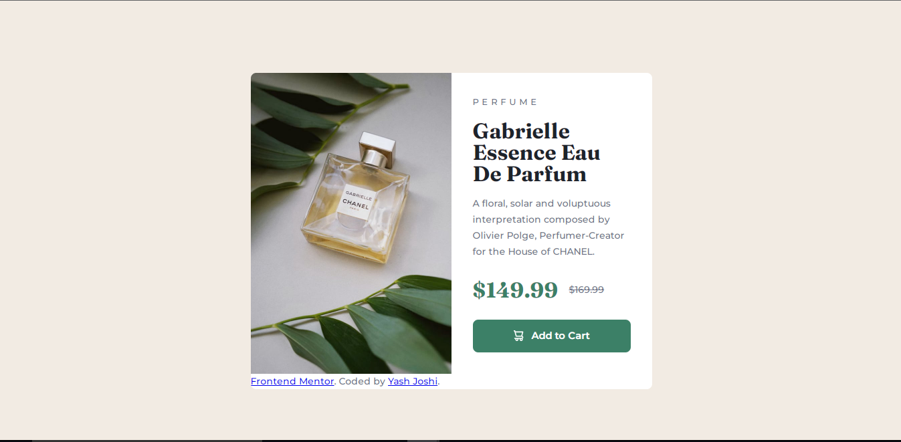

# Frontend Mentor - Product preview card component solution

This is a solution to the [Product preview card component challenge on Frontend Mentor](https://www.frontendmentor.io/challenges/product-preview-card-component-GO7UmttRfa). Frontend Mentor challenges help you improve your coding skills by building realistic projects.

## Table of contents

- [Overview](#overview)
  - [Screenshot](#screenshot)
  - [Links](#links)
- [My process](#my-process)
  - [Built with](#built-with)
- [Author](#author)

## Overview

### Screenshot

### Links

- Solution URL: [https://github.com/yashgjoshi20/QR-code-component]

## My process

Rather than complicate this with using a framework, I felt using HTML and CSS on their own would be sufficient.

### Built with

- Semantic HTML5 markup
- CSS custom properties

## Author

- GitHub - Yash Joshi (https://github.com/yashgjoshi20)
- Frontend Mentor - Yash Joshi (https://www.frontendmentor.io/profile/yashgjoshi20)
